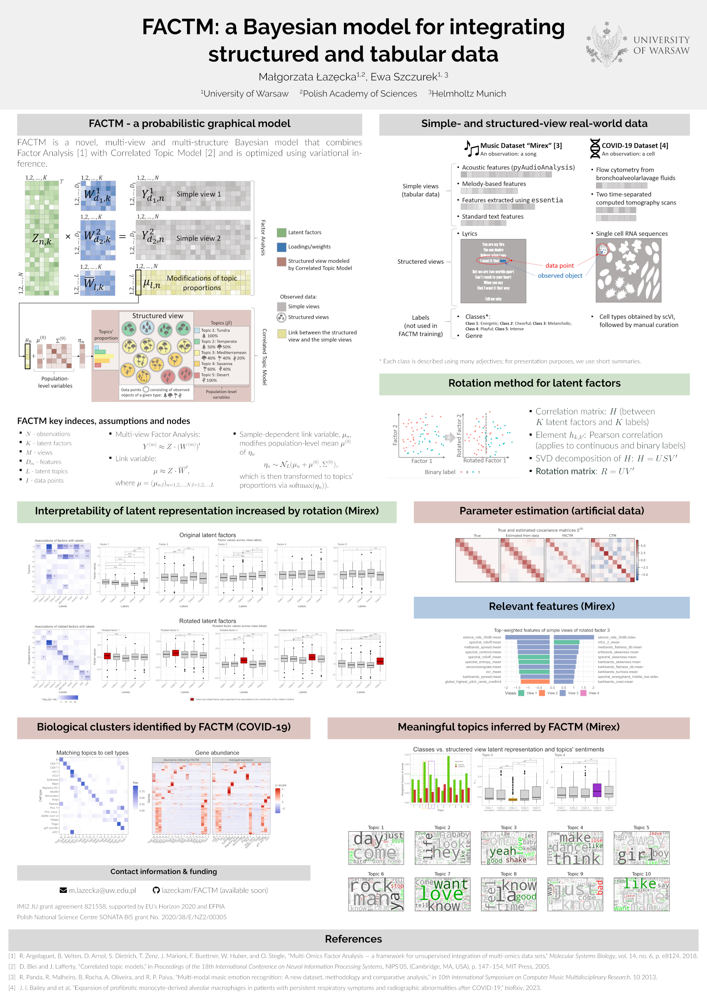

# FACTM

Factor Analysis with Correlated Topic Model - multi-view and
multi-structure Bayesian probabilistic graphical model for data integration.

[Arxiv](#article) | [Example](#basic) | [Cite](#cite)

## Article

Available soon.

## Basic usage

Here is the [link](https://github.com/lazeckam/FACTM/blob/main/Example.ipynb) to the example notebook, and the code for the model is in the `factm` folder (we show in the notebook how to load it and use it).

## FACTM code

Folder `factm` contains the implementation of the FACTM, and also Factor Analysis (`factm_fa.py`) and Correlated Topic Model (`factm_ctm.py`) algorithms.

### Rotations

The code for rotations is temporarily in the notebook `data/data_analysis/mirex/factm_interpretation.ipynb`.

## Simulations

See the `simulations` and `figures` folders.

We provide code that generates artificial data used in simulations, along with an example dataset (only one example is provided due to the large file sizes). Additionally, we provide code to compute performance metrics across all scenarios and models.

## Benchmarks and real-world datasets

See the `data` and `figures` folders.

### Data preprocessing

The datasets used in this article are freely available for download. Below are the links to access them:

 - [MOSI](https://drive.google.com/drive/folders/1uEK737LXB9jAlf9kyqRs6B9N6cDncodq) and [MOSEI](https://drive.google.com/drive/folders/1A_hTmifi824gypelGobgl2M-5Rw9VWHv)
 - [MIREX](https://www.kaggle.com/datasets/imsparsh/multimodal-mirex-emotion-dataset)
 - COVID-19: [biorxiv](https://www.biorxiv.org/content/10.1101/2023.07.30.551145v1).

In `data/data_preprocessing` we provide code to preprocess these datasets to obtain the proper input to the models.

### Data Analysis

Refer to the `data/data_analysis` folder for both the performance on benchmarks and the detailed analysis of the Mirex and COVID-19 datasets.

## Figures

For Figs. 2, 3, 4, 5, 6, 7 from the main text, Figs. B.2, B.3, B.6, B.7 from the Appendix B, and tables see the folder `figures`.

<!-- For Fig. B.4 see -->

For Fig. B.5 see `data/data_analysis/mirex/factm_interpretation.ipynb`.

## Citation & contact information

If you use FACTM, please use the following citation:

> Available soon

If you would like to contact the authors, please reach out to m.lazecka at uw.edu.pl.